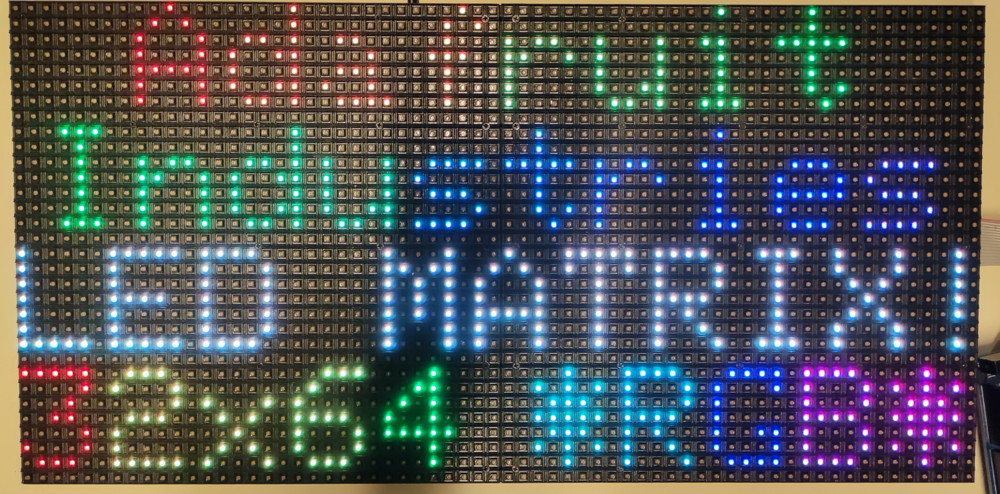
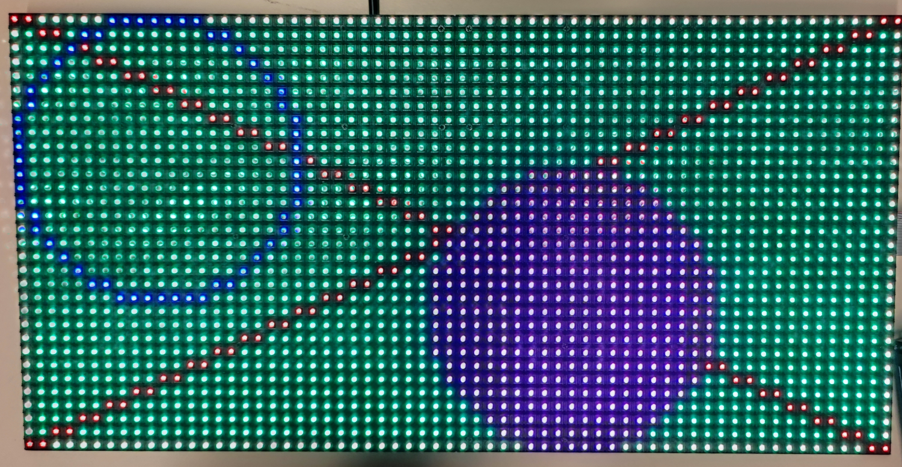
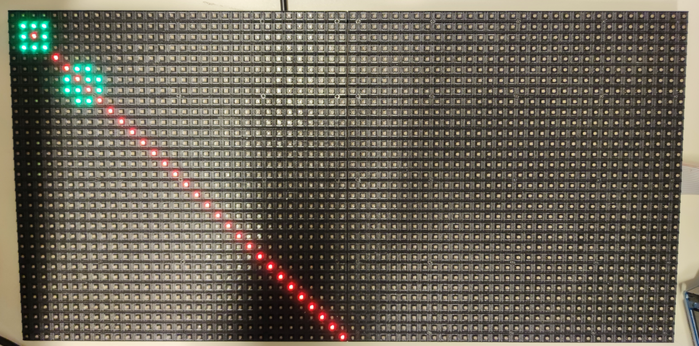

# Rapport de séance - séance du 03/01/2022 (BIZEL Edgar)

# Électronique

## Choix entre Teensy et Arduino (voir rapport précédent)

Dans le rapport précédent, j'avais rencontré des difficultés avec la puce Teensy.
Il paraissait impossible de relier tous les équipements nécessaires à cette puce.

Après des essais durant les vacances, j'ai pris la décision d'utiliser un Arduino Mega.
Cette carte est beaucoup plus limité. Mais en faisant attention à la consommation du programme de Saberduino, je pense qu'il est possible de s'en accommoder.

Si les faits viennent contredire cette hypothèse, il sera toujours possible de s'adapter. Le jeu sera peut-être moins fluide, moins complexe ou moins beau, mais cela n'empêchera pas son utilisation.

Si jamais je dispose de temps supplémentaire à la fin du projet, je pourrai peut-être essayer de migrer vers une Teensy, mais cela paraît improbable.

## Branchement de l'écran

J'ai passé une heure à brancher l'écran et à le faire fonctionner. Le branchement était relativement complexe : 14 câbles à brancher sans numéro pour savoir quel prise correspond à quel port.
Avec le manuel de Adafruit, j'ai fini par réussir après une dernière difficulté : un faux contact rendant l'utilisation de la couleur rouge impossible.

Voici quelques images de l'exemple fourni avec la librairie :





# Information

J'ai continué la programmation de l'affichage du jeu. Voici le code intégral permettant de faire fonctionner l'écran
```cpp
class Display
{
    Display() : window_(A, B, C, D, CLK, LAT, OE, true, 64) {
        window_.begin();
    }

    bool begin_frame() {
        window_.fillScreen(window_.Color333(0, 0, 0));
        return true;
    }

    void draw_square(Position center, Color c, uint8_t size) {
        window_.drawRect(center.x + size / 2, center.y + size / 2, size, size,
                        window_.Color888(c.r, c.g, c.b));
    }

    void draw_line(Position start, Position end, Color c) {
        window_.drawLine(start.x, start.y, end.x, end.y,
                        window_.Color888(c.r, c.g, c.b));
    }

    void end_frame() {
        window_.swapBuffers(false);
    }
```
On utilise la même classe `Display` que pour l'affichage sur ordinateur, mais le contenu des fonctions est différent.


Cependant, après essai, le résultat n'est pas le même sur PC et sur écran LED :




Le nombre de carré n'est pas significatif, cela est volontaire. Mais la diagonale rouge devrait être bien plus courte sur la matrice de LEDs, pour correspondre au rendu sur PC.

J'essayerai de corriger cela avant la prochaine séance.
