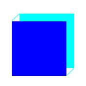

# Rapport de séance - séance du 03/01/2022 (BIZEL Edgar)

# Correction de bugs

### Étrange bug avec la matrice de LEDs

Sans raison apparente, la matrice de LEDs s'est mise à fonctionner de façon étrange.

Au lieu d'afficher les pixels de façon normale, ceux-ci clignotaient sans arrêt, sans jamais s'arrêter sur une image stable.

Pourtant, l'exemple fourni par la librairie fonctionnait normalement : le code devait donc avoir un problème.

Après de nombreux essais, j'ai fini par localiser la cause du bug, même si je ne me l'explique pas.

Code simplifié, avant correction
```cpp
Display display; // Matrice de LEDs
display.init(); // Initialise l'affichage

void setup() { /* diverses initialisations */ }
void loop() { /* affichage sur la matrice */ }
```
Code simplifié, après correction
```cpp
Display display; // Matrice de LEDs

void setup() 
{ 
	/* diverses initialisations */ 
	display.init(); // Initialise l'affichage
}
void loop() { /* affichage sur la matrice */ }
```
Il fallait donc déplacer l'initialisation de la matrice à la fin du setup

### Suppression de blocs

Les blocs sont affichés au fur et à mesure du temps. Lorsque le temps d'un bloc est dépassé, celui-ci est supprimé.
Voici le code responsable de ce comportement :
```cpp
void Level::update(Display& display, Position pos) { // pos correspond à la position du sabre
    cur_time_ = milli_scaled(); // milli_scaled est une fonction équivalente à millis() mais moins précise
    for (auto block : blocks_) {  // On a une liste de blocs. On les regarde un par un
        if (block.time < cur_time_) { // Si le temps du bloc est passé...
            block = {};  // On le supprime
            continue; // Et on passe au bloc suivant
        }
        if (pos_approx(block.pos, pos)) // Si le sabre est proche du bloc
            destroy_block(display, block); // On détruit le bloc

        // block.time always greater than cur_time
        const auto diff = block.time - cur_time_; // Différence entre le temps actuel et le temps du bloc
        if (diff < kMaxDelta) // Si la différence est assez faible
            display_block(display, block, diff); // On affiche le bloc
    }
}
```
Cependant, ce code ne fonctionne pas correctement. Les blocs n'étaient jamais détruits.

Cela était dû à une erreur d'apparence simple : un `&` manquant

En effet, on aurait dû avoir `for (auto &block : blocks_)`. Notez le `&` supplémentaire

Sans ce caractère, cette boucle regardait des *copies* des blocs, pas les blocs en eux-mêmes. Supprimer ces copies n'avait aucun effet

# Affichage

## Dessin d'un cube

Dans Saberduino, le graphisme le plus important est le cube. En effet, des blocs cubiques arrivent vers le joueur, et il devra les détruire.

Pour représenter un cube, j'ai choisi de dessiner le carré du fond, puis d'ajouter le carré de face par dessus, en cachant les parties recouvertes.

Il faut ensuite relier les deux faces. Le code suivant est responsable de cette tâche :
```cpp
void Display::draw_cube(Position topleft, 
                        uint8_t size,
                        Color frontc,
                        Color backc) {
    auto x = topleft.x;
    auto y = topleft.y;
    auto x2 = static_cast<uint8_t>(x + 2);
    auto y2 = static_cast<uint8_t>(y - 2);

    // Back square
    fill_rect({x2, y2}, backc, size, size);
    // Front square (overwrites back)
    fill_rect({x, y}, frontc, size, size);

    // Link both
    draw_line({static_cast<uint8_t>(x + 1), static_cast<uint8_t>(y - 1)},
              {x2, y2}, backc);
    draw_line(
        {static_cast<uint8_t>(x + size), static_cast<uint8_t>(y + size - 2)},
        {static_cast<uint8_t>(x2 + size - 1),
         static_cast<uint8_t>(y2 + size - 1)},
        backc);
}
```
La fonction `draw_cube` affiche un cube à la position `topleft` de taille `size`. Elle utilise deux couleurs différentes pour séparer le fond et le devant.

`x2` et `y2` sont la position du deuxième carré, le fond. J'ai choisi de séparer les deux carrés de deux pixels seulement : en effet, c'est le minimmum pour donner un effet de perspective, et cela permet de ne pas utiliser trop de place. Il faut garder à l'esprit que notre "écran" contient seulement 32x64 pixels

On dessine deux carrés remplis à la suite avec `fill_rect`, aux positions du carré arrière et du carré de face.

Enfin, on relie les deux avec des lignes diagonales.

Cette approche fonctionne bien sur la matrice de leds :



Mais sur ordinateur, le résultat ne correspond pas :


Cela est dû au nombre de pixels plus grand sur PC. Il faut remplir tout l'espace entre les deux carrés, pas se contenter de tracer une simple ligne.

