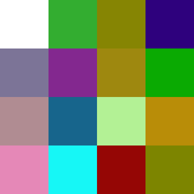

# Rapport de séance - séance du 31/01/2022 (BIZEL Edgar)

Dans cette séance, j'étais censé travailler avec mon partenaire sur la connexion Bluetooth de nos deux appareils. Nous aurions dû la mettre en place et s'accorder sur la manière dont nous échangerions des données.

Cependant, Damien était absent à cette séance. Ne pouvant travailler sans lui, j'ai prêté main forte à un camarade, Loic Palayer.

# Affichage de n'importe quelle image sur une matrice de LEDs

Le projet de Loic et le nôtre ont une chose en commun : une matrice de LEDs. Loic m'a demandé de l'aider à réaliser une tâche complexe : rendre n'importe quelle image affichable sur la matrice de LEDs.

Bien que n'ayant pas prévu cette fonctionnalité à la base, j'ai décidé de l'assister. En effet, il n'est pas impossible que cela me serve dans la suite du projet.

J'ai choisi d'écrire cet outil en Python.

## Recherches sur le chargement d'une image

Pour pouvoir traiter une image, la première chose à faire est de la charger en mémoire. La solution qui m'a paru la plus simple est d'utiliser le format PPM.

Le format PPM est un format d'image extrêmement simple. Voici une image de 4 pixels par 4 pixels au format PPM:
```
P3
4 4
255
255 255 255 51 173 48 134 133 3 46 1 125
124 116 151 131 40 143 158 136 15 10 170 2
176 140 146 23 101 140 179 241 149 185 141 8
229 136 183 22 247 246 149 6 5 125 133 187
```

La première ligne, "P3", indique que l'image est au format PPM.

La seconde ligne donne les dimensions de l'image : 4 par 4

La troisième donne la valeur maximale d'une couleur. Le plus souvent, il s'agit de 255 (valeur maximale pour 8 bits).

Les lignes suivantes contiennent les données de l'image, pixel par pixel. Il faut regrouper les nombres par 3.

Etudions les 3 premiers nombre de la 4e ligne : `255 255 255`. Ils correspondent à une couleur au format RGB. Nous pouvons voir qu'il y a en tout 16 triplets de nombres : les 16 pixels de l'image.

Cette image sera affichée de la manière suivante : 


## Conversion de l'image originale vers PPM

Le format PPM est le plus simple à traiter pour moi ; faut-il encore que je trouve des images dans ce format. Celui-ci étant très peu répandu, c'est presque impossible. Heureusement, il existe un logiciel très pratique nommé *ImageMagick*. Celui-ci permet d'effectuer de nombreuses opérations sur les images, y compris transformer n'importe quel format en PPM.

Mon code Python dépend donc de ce logiciel. Voici le code qui convertit une image quelconque en PPM :
```py
def to_ppm(png_path: str) -> str:
    # run convert.exe
    subprocess.run(
        f"convert.exe -compress none {png_path} {PPM_PATH}",
        check=True)
    return PPM_PATH
```
On exécute simplement ImageMagick, et on lui demande de procéder à la conversion. L'équivalent en ligne de commandes serait `convert.exe -compress none png_path PPM_PATH`.

## Redimensionnement

La plupart des images ont bien plus de pixels que ce que la matrice pourrait afficher. Difficile d'afficher une image FullHD (1920 * 1080) sur un écran de 32 * 32.

Heureusement, *ImageMagick* intègre une fonctionnalité de redimmensionnement. Il suffit de l'activer avec l'option `-resize`.

## Chargement du PPM

Le PPM est prêt. Nous allons maintenant le charger en mémoire. Nous commençons par définir la structure du fichier. D'abord la classe `RGB`, qui contient simplement les composantes Red, Green, Blue d'une couleur.
```py
@dataclass # Equivalent de "struct" en C
class RGB:
    r: int
    g: int
    b: int
```
Puis l'image PPM en elle-même. On garde simplement sa largeur `x`, sa hauteur `y`, et les pixels.
```py
class PPM:
    def __init__(self): ## Constructeur de la classe
        self.data: List[RGB] = []
        self.x = 0
        self.y = 0
```
Et enfin, le code (simplifié) pour lire le fichier :
```py
def parse_ppm(path: str) -> PPM:
    f = open(path, "r") # On ouvre le fichier en lecture

    ret = PPM()
    f.readline() # On ignore la première ligne
    first_line = f.readline().split(" ") # On lit la taille x/y
    ret.x = int(first_line[0]) # On récupère la largeur en tant qu'entier
    ret.y = int(first_line[1]) # De même pour la hauteur

    f.readline() # On ignore la profondeur de couleur. On suppose qu'il s'agit de 255

    data = iter(f.read().strip().split()) # On charge le reste du fichier
    while True:
        try:
            r, g, b = map(int, (next(data), next(data), next(data))) # On lit trois valeurs à la fois
            ret.data.append(RGB(r, g, b)) # On les ajoute à la liste des pixels
        except StopIteration: # On s'arrête une fois arrivé à la fin du fichier
            break
    return ret

```

## Conversion en noir et blanc

Certaines matrices de LEDs, y compris celle de Loic, ne peuvent afficher que deux couleurs. Il faut donc un moyen de convertir ce PPM couleur en PPM noir et blanc.

Pour simplifier la tâche, on suppose que le code RGB `255 255 255` correspond au blanc, et tout autre code correspond à du noir.

Une classe est créée pour représenter un PPM en noir et blanc. Voici le code de conversion :
```py
def to_ppm_blackwhite(ppm: PPM) -> PPMBlackWhite:
    ret = PPMBlackWhite()
    ret.x, ret.y = ppm.x, ppm.y # On récupère longueur / hauteur
    for rgb in ppm.data:
        ret.data.append(rgb != RGB(255, 255, 255)) # La conversion se fait ici
    return ret
```

## Conversion en code C++

Pour finir, on convertit le PPM noir et blanc en code C++. Par exemple, l'image donnée en exemple ci-dessus correspondra au code suivant :
```cpp
constexpr bool data[16] = {
1,0,0,0,
0,0,0,0,
0,0,0,0,
0,0,0,0,
};
```

Il s'agit de manipulation de chaîne de caractère. Le code n'est pas particulièrement beau, mais fonctionne :
```py
def to_c_array(ppmbw: PPMBlackWhite) -> str:
    ret = f"constexpr bool data[{ppmbw.x * ppmbw.y}]" + "{\n"
    for i, is_black in enumerate(ppmbw.data):
        if i != 0 and i % ppmbw.x == 0:
            ret += "\n"
        ret += f"{int(is_black)},"
    ret += "\n};"
    return ret
```

## Assemblage

Il n'y a plus qu'à appeler toutes ces fonctions à la suite :
```py
def main():
    to_ppm("test.png", resize="32x32") # On convertit le fichier "test.png", et on le redimmensionne en 32 par 32
    ppm = parse_ppm(PPM_PATH) # On le lit en mémoire
    ppmbw = to_ppm_blackwhite(ppm) # On le convertit en noir et blanc
    print(to_c_array(ppmbw)) # On affiche le code C++
```

## Un exemple

Testons le programme sur le logo de GitHub


Le résultat est :
```
constexpr bool data[1024]{
1,1,1,1,1,1,1,1,1,1,1,1,1,1,1,1,1,1,1,1,1,1,1,1,1,1,1,1,1,1,1,1,   
1,1,1,1,1,1,1,1,1,1,1,1,1,1,1,1,1,1,1,1,1,1,1,1,1,1,1,1,1,1,1,1,   
1,1,1,1,1,1,1,1,1,1,1,1,1,1,1,1,1,1,1,1,1,1,1,1,1,1,1,1,1,1,1,1,   
1,1,1,1,1,1,1,1,1,1,1,1,1,1,1,1,1,1,1,1,1,1,1,1,1,1,1,1,1,1,1,1,   
1,1,1,1,1,1,1,1,1,1,1,1,1,1,0,0,0,0,1,1,1,1,1,1,1,1,1,1,1,1,1,1,   
1,1,1,1,1,1,1,1,1,1,0,1,0,0,0,0,0,0,0,0,0,1,1,1,1,1,1,1,1,1,1,1,   
1,1,1,1,1,1,1,1,1,1,0,0,0,0,0,0,0,0,0,0,0,0,0,1,1,1,1,1,1,1,1,1,   
1,1,1,1,1,1,1,1,0,0,0,0,0,0,0,0,0,0,0,0,0,0,0,0,0,1,1,1,1,1,1,1,   
1,1,1,1,1,1,1,0,0,1,1,1,0,0,0,0,0,0,0,0,0,1,1,1,1,0,1,1,1,1,1,1,   
1,1,1,1,1,1,0,0,1,1,1,1,1,1,1,1,1,1,1,1,1,1,1,1,1,0,0,1,1,1,1,1,   
1,1,1,1,1,0,0,0,1,1,1,1,1,1,1,1,1,1,1,1,1,1,1,1,1,0,0,1,1,1,1,1,   
1,1,1,1,1,0,0,0,1,1,1,1,1,1,1,1,1,1,1,1,1,1,1,1,1,0,0,0,1,1,1,1,   
1,1,1,1,1,0,0,0,1,1,1,1,1,1,1,1,1,1,1,1,1,1,1,1,1,0,0,0,1,1,1,1,   
1,1,1,1,0,0,0,0,1,1,1,1,1,1,1,1,1,1,1,1,1,1,1,1,1,0,0,0,0,1,1,1,   
1,1,1,1,0,0,0,1,1,1,1,1,1,1,1,1,1,1,1,1,1,1,1,1,1,1,0,0,0,1,1,1,   
1,1,1,0,0,0,0,1,1,1,1,1,1,1,1,1,1,1,1,1,1,1,1,1,1,1,0,0,0,1,1,1,   
1,1,1,0,0,0,0,1,1,1,1,1,1,1,1,1,1,1,1,1,1,1,1,1,1,1,0,0,0,1,1,1,   
1,1,1,0,0,0,0,1,1,1,1,1,1,1,1,1,1,1,1,1,1,1,1,1,1,1,0,0,0,1,1,1,   
1,1,1,0,0,0,0,1,1,1,1,1,1,1,1,1,1,1,1,1,1,1,1,1,1,1,0,0,0,1,1,1,   
1,1,1,1,0,0,0,1,1,1,1,1,1,1,1,1,1,1,1,1,1,1,1,1,1,0,0,0,0,1,1,1,   
1,1,1,1,0,0,0,0,1,1,1,1,1,1,1,1,1,1,1,1,1,1,1,1,1,0,0,0,0,1,1,1,   
1,1,1,1,1,0,0,0,1,1,1,1,1,1,1,1,1,1,1,1,1,1,1,1,0,0,0,0,1,1,1,1,   
1,1,1,1,1,0,1,1,1,1,1,1,1,1,1,1,1,1,1,1,1,1,1,0,0,0,0,0,1,1,1,1,   
1,1,1,1,1,0,1,1,1,1,0,0,1,1,1,1,1,1,1,1,1,0,0,0,0,0,0,1,1,1,1,1,   
1,1,1,1,1,1,0,1,1,1,1,0,1,1,1,1,1,1,1,1,0,0,0,0,0,0,1,1,1,1,1,1,   
1,1,1,1,1,1,1,0,1,1,1,1,1,1,1,1,1,1,1,1,0,0,0,0,0,0,1,1,1,1,1,1,   
1,1,1,1,1,1,1,0,1,1,1,1,1,1,1,1,1,1,1,1,0,0,0,0,0,1,1,1,1,1,1,1,   
1,1,1,1,1,1,1,1,1,0,1,1,1,1,1,1,1,1,1,1,0,0,0,1,1,1,1,1,1,1,1,1,   
1,1,1,1,1,1,1,1,1,1,1,0,1,1,1,1,1,1,1,1,0,0,1,1,1,1,1,1,1,1,1,1,   
1,1,1,1,1,1,1,1,1,1,1,1,1,1,1,1,1,1,1,1,1,1,1,1,1,1,1,1,1,1,1,1,   
1,1,1,1,1,1,1,1,1,1,1,1,1,1,1,1,1,1,1,1,1,1,1,1,1,1,1,1,1,1,1,1,   
1,1,1,1,1,1,1,1,1,1,1,1,1,1,1,1,1,1,1,1,1,1,1,1,1,1,1,1,1,1,1,1,   
};
```
Rien qu'en regardant le texte, on devine la forme de l'image. Succès !

## Bugs

Malheureusement, quelques bugs subsistent. Le programme ne fonctionne pas avec toutes les images. Par exemple, les images doivent être rigoureusement carrées, au pixel près.

Rien qui ne puisse être corrigé, mais cela nécessitera un peu plus de temps. Ce travail devra être effectué par Loic.

# Conclusion

Je tiens à préciser que ce script pourra être utilisé par n'importe qui utilisant une matrice de LEDs. Il pourra peut-être servir pour d'autres projets, pour les futurs PeiP2.

Je le mettrai donc en libre accès sur mon GitHub une fois qu'il sera terminé.