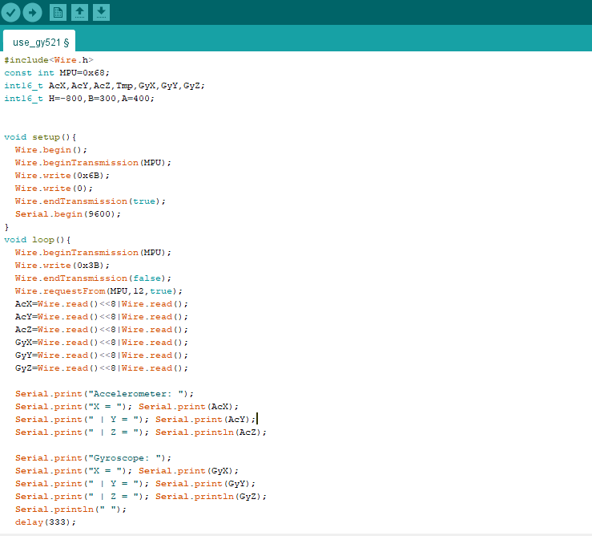

Phan Damien

# Compte rendu séance 3

## Recherche de code le plus optimisé

Durant la première heure, j'ai cherché des codes sur internet sur l'utilisation de la puce GY-521 (accéléromètre/gyroscope) afin de m'aider à la compréhension de l'appareil.

J'ai alors compris que l'on utilise une bibliothèque nommée Wire.h afin de pouvoir obtenir les données de la puce GY-521.
J'utilise alors le code suivant : 
 

## Problèmes majeurs

Malgrès l'obtention de valeurs concrètes, je ne comprends pas comment peut-on determiner une quelconque position ou un certain mouvement autre qu'une simple inclination.

En effet, les valeurs récupérées par l'appareil suite au transfert des codes ne sont pas "stables".
Par exemple, si j'élève l'objet, les valeurs en y passent en négatif (<-2000) mais peuvent certaines fois être, à un certain moment donné, positive (+700).
Ces erreurs me rendent confus par rapport à leur application lors de l'affichage sur l'écran.

Cela nous mène au problème suivant : l'interprétation des valeurs.

Même sans valeurs que l'on va déterminer d'erronées, je ne vois pas comment créer un potenciel point qui puisse se déplacer avec les mouvements d'une "télécommande".

## Potentielles solutions

Si le problème persiste, je pourrais simplifier la tâche en ne cherchant qu'à obtenir une certaine direction plutôt que la position exacte de l'objet.