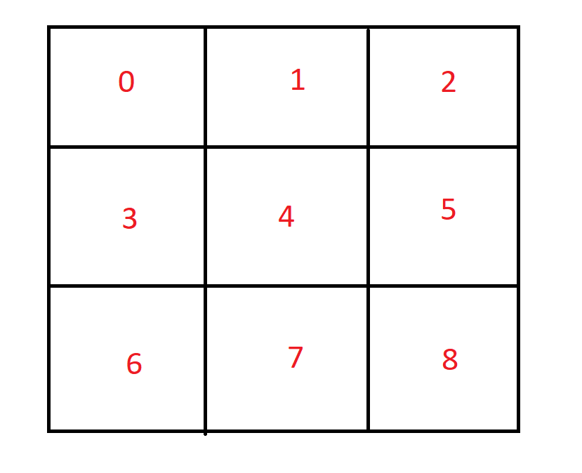

Phan Damien

# Compte rendu séance 6

## Obtention de nouvelles données 

Grâce au code de l'exemple de la bibliothèque de MP6050_DMP6, on obtient des données en fonction de l'inclinaison du module GY-521 (yaw/pitch/roll).

```php

    #ifdef OUTPUT_READABLE_YAWPITCHROLL
        // display Euler angles in degrees
        mpu.dmpGetQuaternion(&q, fifoBuffer);
        mpu.dmpGetGravity(&gravity, &q);
        mpu.dmpGetYawPitchRoll(ypr, &q, &gravity);
        Serial.print("ypr\t");
        Serial.print(ypr[0] * 180/M_PI);
        Serial.print("\t");
        Serial.print(ypr[1] * 180/M_PI);
        Serial.print("\t");
        Serial.println(ypr[2] * 180/M_PI);
    #endif

```

Grâce à ces données, on peut faire quelques tests en inclinant le module. 
Ceci fait, cela nous les valeurs correspondantes aux différentes mouvements/inclinaisons (droite/gauche/haut/bas).

## Interprétation de ces données

Ici pour chaque direction, on attribue un nombre.


On va alors essayer de restreindre un intervalle en yaw,pitch ou roll afin de pouvoir attribuer une direction aux données obtenues : 

```php

        if ((ypr[1] * 180/M_PI) <= -20 || (ypr[0] * 180/M_PI) >= -30 ){
        Serial.println("5");//droite 
        }
        else if ((ypr[1] * 180/M_PI) >= 20 || (ypr[0] * 180/M_PI) <= -90 ){
        Serial.println("3");//gauche
        }
        if ((ypr[2] * 180/M_PI) <= -20){
        Serial.println("7");//bas 
        }
        else if ((ypr[2] * 180/M_PI) >= 20){
        Serial.println("1");//haut
        }
        else {
        Serial.println("0");//centre
        }

```
Donc dans la pratique, on obtient un chaîne de nombres que l'on va pouvoir par la suite envoyer grâce au bluetooth vers le programme permettant de bouger le curseur en fonction des mouvements de poignée du joueur.


Cependant, cette façon de procéder n'est pas encore la plus précise.
Il faudrait pour cela que je réduises au maximum l'intervalle afin de réagir au moindre mouvement et donc d'attribuer cela à un certain mouvement.


## Objectifs prochain cours 

Pouvoir modéliser un modèle du sabre afin de pouvoir le construire.

Connecter en bluetooth le module avec l'écran.
