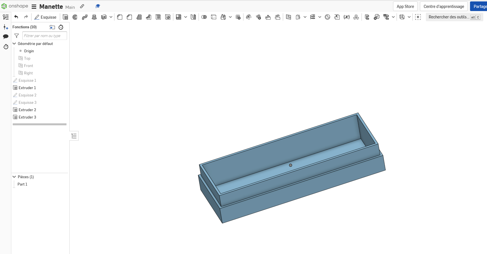
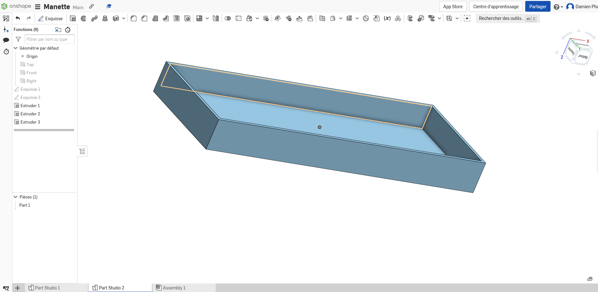

Phan Damien

# Compte rendu séance 8

##  Modélisation de la manette 

Ma séance a été dédiée à la modélisation de la manette permettant d'accueillir les modules GY-521 par exemple.

### Début de l'idée 

Grâce au site Onshape, j'ai pu concevoir l'idée de la boîte servant de manette.

